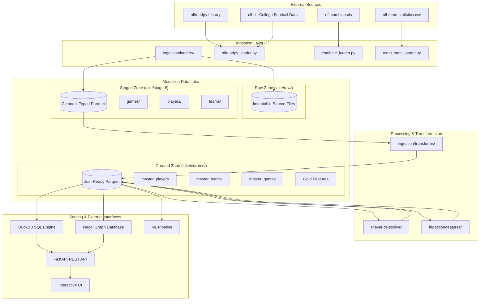

# NFL Data Lake Platform Architecture

This diagram illustrates the data flow and architectural components of the NFL Data Lake Platform.

```mermaid
graph TD
    subgraph "External Sources"
        nflreadpy[nflreadpy Library]
        cfbd[cfbd - College Football Data]
        combine_xls[nfl-combine.xls]
        team_stats_csv[nfl-team-statistics.csv]
    end

    subgraph "Ingestion Layer"
        loaders[ingestion/loaders/]
        loaders_nfl[nflreadpy_loader.py]
        loaders_combine[combine_loader.py]
        loaders_team[team_stats_loader.py]
    end

    subgraph "Medallion Data Lake"
        subgraph "Raw Zone (lake/raw/)"
            raw_data[(Immutable Source Files)]
        end
        
        subgraph "Staged Zone (lake/staged/)"
            staged_data[(Cleaned, Typed Parquet)]
            staged_games[games/]
            staged_players[players/]
            staged_teams[teams/]
        end
        
        subgraph "Curated Zone (lake/curated/)"
            curated_data[(Join-Ready Parquet)]
            master_players[master_players]
            master_teams[master_teams]
            master_games[master_games]
            gold_features[Gold Features]
        end
    end

    subgraph "Processing & Transformation"
        transforms[ingestion/transforms/]
        id_resolver[PlayerIdResolver]
        features[ingestion/features/]
    end

    subgraph "Serving & External Interfaces"
        duckdb[DuckDB SQL Engine]
        neo4j[Neo4j Graph Database]
        fastapi[FastAPI REST API]
        ui[Interactive UI]
        ml[ML Pipeline]
    end

    %% Data Flow
    nflreadpy --> loaders_nfl
    cfbd --> loaders_nfl
    combine_xls --> loaders_combine
    team_stats_csv --> loaders_team

    loaders --> raw_data
    loaders --> staged_data

    staged_data --> transforms
    transforms --> curated_data
    curated_data --> id_resolver
    id_resolver --> curated_data
    curated_data --> features
    features --> curated_data

    curated_data --> duckdb
    curated_data --> neo4j
    
    duckdb --> fastapi
    neo4j --> fastapi
    fastapi --> ui
    curated_data --> ml
```
