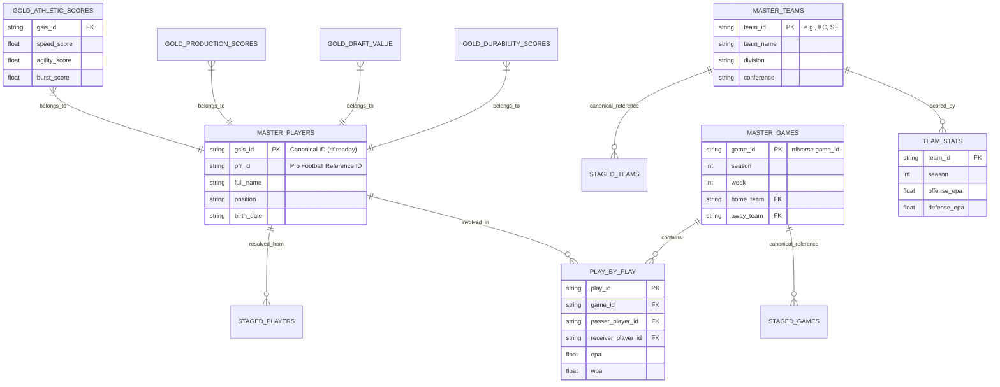

# NFL Data Lake Schema & Relationships

This diagram demonstrates how the curated tables connect within the data lake. Use these relationships as a reference when writing DuckDB SQL queries or traversing the Neo4j graph.

## Medallion Layers Overview

The data lake follows a **Medallion Architecture**, progressing through three distinct zones:

### 1. Raw Zone (`lake/raw/`)
*   **Purpose**: Immutable source-of-truth storage.
*   **Content**: Original files exactly as received from external APIs and loaders (e.g., CSV, HTML/XLS, JSON).
*   **Source of**: `ingestion/loaders/` download data directly here.

### 2. Staged Zone (`lake/staged/`)
*   **Purpose**: Cleaned, typed, and standardized schema.
*   **Content**: Parquet files partitioned by entity (`games/`, `players/`, `teams/`). Data is cast to proper types (dates, floats, etc.) but retains source granularity.
*   **Source of**: Output from `SourceLoader.transform()` method.

### 3. Curated Zone (`lake/curated/`)
*   **Purpose**: High-value, join-ready, and optimized "Gold" data.
*   **Content**: Master tables (`master_players`, `master_teams`) and pre-calculated feature tables (Athletic, Production scores). 
*   **Key Action**: **Player identity resolution** happens here, linking disparate source IDs to a canonical `gsis_id`.
*   **Interface**: Primary target for DuckDB SQL queries and Neo4j graph population.

## ML Model Training & Analytical Goals

The curated data layer is specifically designed to feed into the following ML models and analytical engines as outlined in the [expansion plan](files/plan_updated.md):

| Model / Analytical Goal | Primary Data Inputs (Curated) | Feature Engineering Focus |
|---|---|---|
| **Player Projection Model** | `gold_athletic_scores`, `gold_production_scores`, `master_players`, `college_stats` | Predicts future performance by correlating combine metrics with NFL production and college dominator ratings. |
| **Injury & Durability Analysis** | `gold_durability_scores`, `injury_reports`, `snap_counts` | Models injury risk and career longevity based on historical workload and medical history. |
| **Team Diagnosis & ROI** | `team_stats`, `play_by_play` (EPA/WPA), `contracts` | Evaluates team efficiency and identifies over/under-performing units relative to salary cap spend. |
| **Draft Optimization Engine** | `gold_draft_value`, `gold_athletic_scores`, `scouting_reports` | Ranks prospects by finding "value gaps" between predicted NFL success and current draft projection. |
| **Player-Roster Fit (Simulation)** | `depth_charts`, `play_by_play` (formation/personnel), `master_teams` | Uses graph traversal (Neo4j) and SQL (DuckDB) to simulate how specific player skillsets fit into team-specific schemes. |

## API Endpoints Reference

The FastAPI server provides several interfaces to interact with the data lake, categorized by their primary function and data source.

### 1. SQL Querying (DuckDB)
| Endpoint | Method | Description | Project Context Use Case |
|---|---|---|---|
| `/query` | `POST` | Executes a read-only SQL query against all curated Parquet files. | Ad-hoc analysis, generating custom datasets for ML training, and complex multi-table joins. |
| `/query/tables` | `GET` | Lists all Parquet files currently registered as virtual tables in DuckDB. | Discovering what data is available for SQL analysis. |

### 2. Player Data & Profiles
| Endpoint | Method | Description | Project Context Use Case |
|---|---|---|---|
| `/players` | `GET` | Lists players from the combine dataset with filters for position, school, and draft team. | Bulk extraction of combine metrics for athletic profiling. |
| `/players/search` | `GET` | Searches `master_players` (curated) or `players` (combine) by name. | Finding a specific player's canonical `gsis_id` for downstream API or graph lookups. |
| `/players/{name}` | `GET` | Retrieves the full record of a single player from the combine dataset. | Detailed view of a specific player's pre-draft athletic testing. |

### 3. Team Performance
| Endpoint | Method | Description | Project Context Use Case |
|---|---|---|---|
| `/teams` | `GET` | Lists all unique team abbreviations present in the data lake. | Validating team identities when performing cross-source joins. |
| `/teams/{abbr}/stats` | `GET` | Returns historical season-by-season performance metrics for a specific team. | Powering the Team Diagnosis model and trend analysis of team efficiency. |

### 4. Graph Traversal (Neo4j)
| Endpoint | Method | Description | Project Context Use Case |
|---|---|---|---|
| `/graph/player/{id}/neighbors`| `GET` | Returns the direct relations (teams, colleges, draft classes) of a player. | Understanding network connections and identifying "college pipeline" patterns. |
| `/graph/player/{id}/profile` | `GET` | Comprehensive graph profile including draft value and college info. | Summarizing the career foundation of a player using linked data. |
| `/graph/player/{id}/career` | `GET` | Traverses a player's full timeline through teams, injuries, and snaps. | Visualizing career progression and durability trends. |
| `/graph/team/{abbr}/drafted` | `GET` | Lists all players drafted by a specific team with associated draft value. | Evaluating a team's historically successful (or unsuccessful) draft strategies. |

### 5. Data Management & Inspection
| Endpoint | Method | Description | Project Context Use Case |
|---|---|---|---|
| `/manage/datasets` | `GET` | Lists metadata (rows, size, path) for all Parquet files in the lake. | Auditing the health and scale of the data lake stages. |
| `/manage/preview/{name}` | `GET` | Returns a sample of rows and column-level null statistics for a dataset. | Sanity checking data quality before running complex transformations or training models. |

## Entity Relationship Diagram

